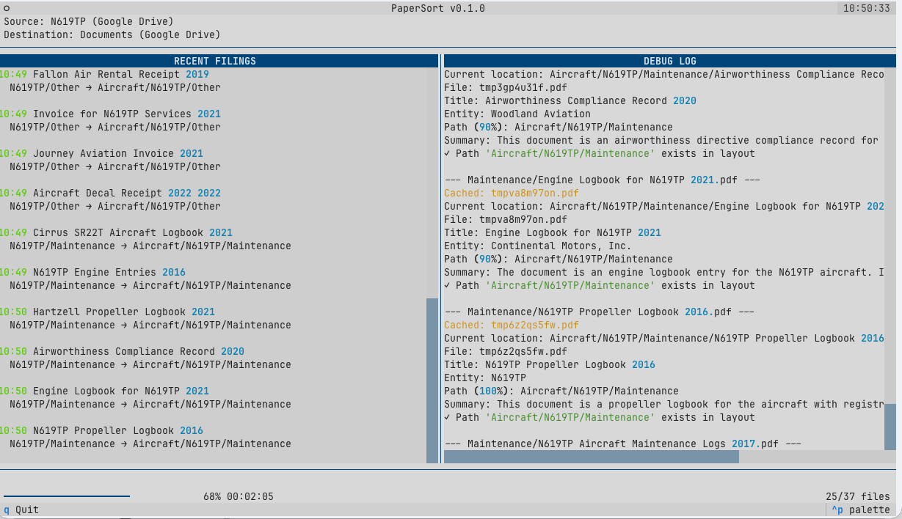

# PaperSort

A tool that automatically sorts PDF documents into folders using an LLM. 
Works great to clean up messy folders, or to use for filing new files from scanners.
Has a nice TextUI or via flag can print to the console. Comes with a Docker container.



You specify the folder structure as a simple text document that looks like this:

```
- Financial : Financial documents and banking records
   - Bank Accounts : Bank statements and account records
      - By company
   - Taxes : Tax returns and related documents
      - By year
   - Insurance : Insurance policies and claims
      - By company
   - Other : Finance documents that don't fit in above subcategories
```


If you are lazy, you can ask an LLM to write the structure for you. Right now the software supports
local files, Google Drive and Dropbox. For models, it supports OpenLLM and Mistral. Drivers for these
are modular and it's very easy to extend to other platforms.

## Quick Start

1. Install [uv](https://docs.astral.sh/uv/)
2. Create credentials if you want to use Dropbox or Google Drive
3. Create `.env` file with your configuration
4. Create `layout.txt` in your document store that describes the layout
5. Run: `uv run main.py --copy`

### Environment Variables

| Variable | Description |
|----------|-------------|
| `MISTRAL_API_KEY` | API key for Mistral AI |
| `OPENAI_API_KEY` | API key for OpenAI |
| `LLM_PROVIDER` | `openai` or `mistral` |
| `INBOX` | Source: `gdrive:<folder-id>`, `local:<path>`, or `dropbox:<path>` |
| `DOCSTORE` | Destination: `gdrive:<folder-id>`, `local:<path>`, or `dropbox:<path>` |

## Usage

```bash
# Process inbox (preview only)
uv run main.py

# Process and copy to document store
uv run main.py --copy

# Verify files exist and re-copy missing
uv run main.py --copy --verify

# Re-analyze documents (ignore cache) and move if path changed
uv run main.py --update --copy

# Daemon mode: monitor inbox, copy, log, delete after success
uv run main.py --ingest

# Repair cache and handle duplicates
uv run main.py --repair

# Process single file
uv run main.py --file /path/to/document.pdf --copy
```

## Command Line Options

| Option | Description |
|--------|-------------|
| `--copy` | Copy files to document store |
| `--verify` | Verify destination exists (re-copy if missing) |
| `--update` | Re-analyze via LLM (ignore cache), move if path changed |
| `--log` | Log incoming files to `--IncomingLog` folder |
| `--inbox <uri>` | Inbox URI (overrides INBOX env var) |
| `--ingest` | Daemon mode: poll inbox, copy, log, delete source |
| `--repair` | Scan docstore, fix cache, handle duplicates |
| `--file <path>` | Process single PDF |
| `--showlayout` | Print folder hierarchy |
| `--deduplicate` | Merge duplicate company folders |
| `--auth-dropbox` | Authenticate with Dropbox (one-time setup) |
| `--cli` | Use CLI output instead of TUI |

## Google Drive Setup

1. Go to [Google Cloud Console](https://console.cloud.google.com/)
2. Create a project (or select existing)
3. Enable the Google Drive API
4. Create a Service Account (IAM & Admin → Service Accounts)
5. Create and download a JSON key for the service account
6. Save as `service_account_key.json` in the project root
7. Share your Drive folders with the service account email address
8. Use the folder ID from the URL: `https://drive.google.com/drive/folders/<folder-id>`

## Dropbox Setup

1. Go to [Dropbox App Console](https://www.dropbox.com/developers/apps)
2. Create a new app with:
   - Scoped access
   - Full Dropbox access
   - Permissions: `files.metadata.read`, `files.content.read`, `files.content.write`
3. Run the authentication flow:
   ```bash
   uv run main.py --auth-dropbox
   ```
4. Enter your App key and App secret when prompted
5. Follow the browser link to authorize
6. Credentials are saved to `dropbox_token.json`

## Layout File

The document store needs a `layout.txt` defining your folder hierarchy:

```
Personal documents for the Smith family.
The Smiths are a family of 5. Parents are Bob and Mary, kids are Steve and Joe.
We have a side business renting out our house on Forest Lake via Airbnb via Lakehouse LLC.
Bob coaches for the local Little League.

---LAYOUT STARTS HERE---

- Financial : Banking and financial documents
   - Bank Accounts : Statements and records
      - By company
      - By year
   - Taxes : Tax returns
      - By year
   - Insurance : Policies and claims
      - By company

- Medical : Health records
   - By year
```

### Special Folders

- **By year**: Auto-creates year subfolders (e.g., `Taxes/2024/`)
- **By company**: Auto-creates company subfolders (e.g., `Insurance/Geico/`)

## Ingest Mode

The ``--ingest`` mode is designed to monitor an inbox. If a new file is detected it moves it to the docstore and additionally save
them into a log. I use this with a ScanSnap scanner. Each scanned file automatically is filed correctly.

Specifically in this mode each file is:
- Written a log directory ``--IngestLog`` in the docstore with the ingest date prepended (i.e. "2026-01-17 Tax Form 1099 for 2024 from...")
- Filed correctly in the right folder in the docstore
- Deleted in the inbox

## Docker container

Dockerfile is included. Works great with ``--ingest`` mode.

## Repair Mode

`--repair` scans the docstore and:
- Fixes cache entries where `copied` flag was incorrectly reset
- Detects duplicates (same file in multiple locations)
- Moves duplicates to `--Duplicate` folder (keeps the one matching suggested path)
- Skips system folders starting with `--`

## License

Apache 2.0 - see LICENSE file.
